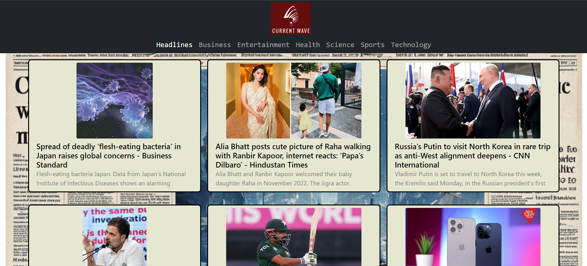

# CurrentWave

## Introduction

Welcome to the Current Wave News App! This project is a React-based web application that displays daily news to users. It features infinite scrolling, categorization of news, and a clean, user-friendly interface. This was my first project and a significant milestone in my journey of learning React.

## Features

- **Infinite Scrolling:** Seamlessly load more news articles as you scroll down the page.
- **News Categories:** Browse news articles by different categories such as Technology, Sports, Business, Health, and more.
- **Responsive Design:** Optimized for desktop and mobile devices to provide a consistent user experience.
- **Live Updates:** Fetches the latest news articles from an external API to keep you updated with current events.

## Technologies Used

- **React:** A JavaScript library for building user interfaces.
- **CSS:** For styling the components and ensuring a responsive design.
- **News API:** An external API used to fetch the latest news articles.

## Installation

To get started with the Daily News App, follow these steps:

1. **Clone the repository:**
   ```sh
   git clone https://github.com/Sidm24/NewsApp.git
   cd news-app
   ```
2. **Obtain an API key:**
     - Sign up for an API key from [NewsApi](https://newsapi.org/)
3. **Create a `.env` file:**
     - Create a .env file in the root directory of the project and add your API key: 
   ```env
     REACT_APP_NEWS_API_KEY=your_api_key_here
   ```
4. **Run the Application**
   
   ```bash
   
   npm run start
   ```

   ***Plese note that the webpage is viewable only through local host due to restrictions from the API owner***

## Contribution

Contributions are welcome! If you have any suggestions or improvements, please open an issue or create a pull request.

## License

This project is licensed under the MIT License. See the [LICENSE](LICENSE) file for details.

## Acknowledgement

- [NewsAPI](https://newsapi.org/) for providing the news data.
- The React community for their extensive documentation and support.

Thank you for checking out the Current Wave News App! I hope you find it useful and enjoy using it as much as I enjoyed building it.

## **Sample Preview of the Webpage**



#### Sample Preview

Click [here](https://currentwave.netlify.app/) to check out the preview of the Current Wave!!
